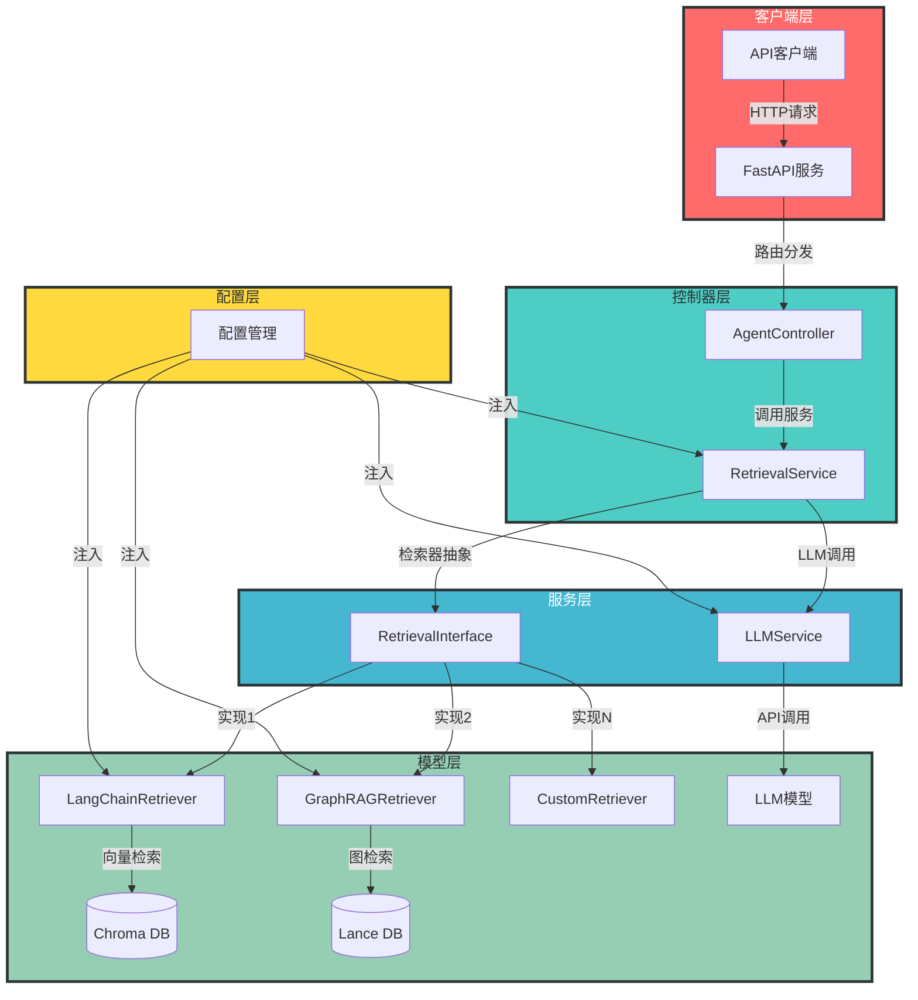

## 1. 架构概述

### 1.1 设计目标

- 使用FastAPI框架构建高效的RESTful API
- 采用MVC设计模式实现代码解耦和可扩展性
- 支持多种检索器配置（LangChain RAG、GraphRAG等）
- 检索器之间完全解耦，支持动态切换
- 提供统一的API接口调用agent能力

### 1.2 架构图



## 2. 目录结构设计

```
agent_service/
├── app/
│   ├── __init__.py
│   ├── api/                     # API路由层
│   │   ├── __init__.py
│   │   └── v1/                  # API版本1
│   │       ├── __init__.py
│   │       ├── agent.py         # Agent相关路由
│   │       └── retrieval.py     # 检索相关路由
│   ├── controllers/             # 控制器层
│   │   ├── __init__.py
│   │   ├── agent_controller.py  # Agent控制器
│   │   └── retrieval_controller.py  # 检索控制器
│   ├── models/                  # 数据模型层
│   │   ├── __init__.py
│   │   ├── retrieval.py         # 检索器模型
│   │   └── llm.py               # LLM模型
│   ├── services/                # 业务服务层
│   │   ├── __init__.py
│   │   ├── agent_service.py     # Agent服务
│   │   ├── retrieval_service.py # 检索服务
│   │   └── llm_service.py       # LLM服务
│   ├── schemas/                 # Pydantic Schema
│   │   ├── __init__.py
│   │   ├── agent.py             # Agent相关Schema
│   │   └── retrieval.py         # 检索相关Schema
│   └── utils/                   # 工具函数
│       ├── __init__.py
│       ├── config.py            # 配置管理
│       └── logger.py            # 日志工具
├── config/                      # 配置文件
│   ├── __init__.py
│   ├── base.py                  # 基础配置
│   └── retrieval_config.py      # 检索器配置
├── tests/                       # 测试文件
│   ├── __init__.py
│   ├── test_agent.py            # Agent测试
│   └── test_retrieval.py        # 检索测试
├── main.py                      # 应用入口
├── requirements.txt             # 依赖管理
└── README.md                    # 项目说明

```

## 3. 核心代码设计

### 3.1 检索器接口设计

```python
# app/models/retrieval.py
from abc import ABC, abstractmethod
from typing import Dict, Any

class RetrievalInterface(ABC):
    """检索器接口，定义检索器的基本方法"""

    @abstractmethod
    def retrieve(self, query: str, **kwargs) -> Dict[str, Any]:
        """执行检索操作"""
        pass

    @abstractmethod
    def get_name(self) -> str:
        """获取检索器名称"""
        pass

```

### 3.2 LangChain RAG检索器实现

```python
# app/models/retrieval.py
from .retrieval import RetrievalInterface
from langchain_community.vectorstores import Chroma
from langchain_huggingface.embeddings import HuggingFaceEmbeddings
from langchain_openai import ChatOpenAI
from langchain_classic.chains import RetrievalQA
import os

class LangChainRetriever(RetrievalInterface):
    """基于LangChain的RAG检索器"""

    def __init__(self, config):
        self.config = config
        self.llm = ChatOpenAI(
            model=os.getenv("MODEL", "qwen-plus"),
            base_url=os.getenv("BASE_URL"),
            api_key=os.getenv("API_KEY")
        )
        self.embedding = HuggingFaceEmbeddings(
            model_name=os.getenv("EMBED_MODEL_PATH", "bge-large-zh-v1.5"),
            model_kwargs={'device': 'cpu'},
            encode_kwargs={'normalize_embeddings': True}
        )
        self.vectorstore = Chroma(
            collection_name=self.config["collection_name"],
            embedding_function=self.embedding,
            persist_directory=self.config["persist_dir"]
        )
        self.retriever = self.vectorstore.as_retriever(
            search_type="mmr",
            search_kwargs={"k": self.config.get("top_k", 5)}
        )

    def retrieve(self, query: str, **kwargs) -> Dict[str, Any]:
        """执行LangChain RAG检索"""
        qa_chain = RetrievalQA.from_chain_type(
            llm=self.llm,
            retriever=self.retriever,
            return_source_documents=True
        )
        result = qa_chain.invoke({"query": query})
        return {
            "answer": result["result"],
            "sources": [
                {
                    "source": doc.metadata.get("source", "unknown"),
                    "page": doc.metadata.get("page", "N/A")
                }
                for doc in result["source_documents"]
            ]
        }

    def get_name(self) -> str:
        return "langchain_rag"

```

### 3.3 检索服务设计

```python
# app/services/retrieval_service.py
from typing import Dict, Any
from app.models.retrieval import RetrievalInterface, LangChainRetriever
from app.utils.config import get_retrieval_config

class RetrievalService:
    """检索服务，管理不同的检索器"""

    def __init__(self):
        self.retrievers: Dict[str, RetrievalInterface] = {}
        self._init_retrievers()

    def _init_retrievers(self):
        """初始化所有配置的检索器"""
        config = get_retrieval_config()

        # 初始化LangChain RAG检索器
        if config.langchain_rag.enabled:
            self.retrievers["langchain_rag"] = LangChainRetriever(config.langchain_rag.config)

        # 初始化GraphRAG检索器（待实现）
        # if config.graphrag.enabled:
        #     self.retrievers["graphrag"] = GraphRAGRetriever(config.graphrag.config)

    def get_retriever(self, retriever_name: str) -> RetrievalInterface:
        """获取指定名称的检索器"""
        if retriever_name not in self.retrievers:
            raise ValueError(f"Retriever {retriever_name} not found")
        return self.retrievers[retriever_name]

    def retrieve(self, retriever_name: str, query: str, **kwargs) -> Dict[str, Any]:
        """调用指定检索器执行检索"""
        retriever = self.get_retriever(retriever_name)
        return retriever.retrieve(query, **kwargs)

    def list_retrievers(self) -> Dict[str, str]:
        """列出所有可用的检索器"""
        return {
            name: retriever.get_name()
            for name, retriever in self.retrievers.items()
        }

```

### 3.4 API路由设计

```python
# app/api/v1/retrieval.py
from fastapi import APIRouter, Depends
from typing import Dict, Any
from app.services.retrieval_service import RetrievalService
from app.schemas.retrieval import RetrievalRequest, RetrievalResponse

router = APIRouter(prefix="/retrieval", tags=["retrieval"])

@router.post("/query", response_model=RetrievalResponse)
async def retrieve(
    request: RetrievalRequest,
    retrieval_service: RetrievalService = Depends()
) -> Dict[str, Any]:
    """执行检索请求"""
    result = retrieval_service.retrieve(
        retriever_name=request.retriever_name,
        query=request.query,
        **request.kwargs
    )
    return {
        "query": request.query,
        "retriever": request.retriever_name,
        "result": result
    }

@router.get("/retrievers", response_model=Dict[str, str])
async def list_retrievers(
    retrieval_service: RetrievalService = Depends()
) -> Dict[str, str]:
    """列出所有可用的检索器"""
    return retrieval_service.list_retrievers()

```

### 3.5 配置管理设计

```python
# app/utils/config.py
from pydantic_settings import BaseSettings
from typing import Dict, Any, Optional

class LangChainRAGConfig(BaseSettings):
    """LangChain RAG检索器配置"""
    enabled: bool = True
    config: Dict[str, Any] = {
        "persist_dir": "./data/rag_db",
        "collection_name": "rag",
        "chunk_size": 500,
        "chunk_overlap": 50,
        "top_k": 5
    }

class GraphRAGConfig(BaseSettings):
    """GraphRAG检索器配置"""
    enabled: bool = False
    config: Dict[str, Any] = {
        "data_dir": "./data/graphrag",
        "lancedb_uri": "./data/graphrag/lancedb"
    }

class RetrievalConfig(BaseSettings):
    """检索器配置"""
    langchain_rag: LangChainRAGConfig = LangChainRAGConfig()
    graphrag: GraphRAGConfig = GraphRAGConfig()

# 全局配置实例
_retrieval_config = RetrievalConfig()

def get_retrieval_config() -> RetrievalConfig:
    """获取检索器配置"""
    return _retrieval_config

```

### 3.6 应用入口设计

```python
# main.py
from fastapi import FastAPI
from app.api.v1 import agent, retrieval
from app.utils.config import get_retrieval_config

app = FastAPI(
    title="Agent Service API",
    description="基于FastAPI的MVC架构Agent服务",
    version="1.0.0"
)

# 注册路由
app.include_router(agent.router, prefix="/api/v1")
app.include_router(retrieval.router, prefix="/api/v1")

@app.get("/")
async def root():
    """根路径，返回服务状态"""
    return {
        "message": "Agent Service is running",
        "version": "1.0.0",
        "retrievers": list(get_retrieval_config().dict().keys())
    }

if __name__ == "__main__":
    import uvicorn
    uvicorn.run(app, host="0.0.0.0", port=8000)

```

## 4. 实施步骤

### 4.1 环境准备

1. 创建项目目录结构
2. 安装依赖包
3. 配置环境变量

### 4.2 核心功能实现

1. 实现检索器接口
2. 实现LangChain RAG检索器
3. 实现检索服务
4. 实现API路由
5. 实现配置管理
6. 实现应用入口

### 4.3 测试验证

1. 启动FastAPI服务
2. 测试API接口
3. 验证检索功能
4. 测试不同检索器切换

### 4.4 扩展功能

1. 实现GraphRAG检索器
2. 添加认证授权
3. 添加日志记录
4. 添加监控指标
5. 实现更多检索器类型

## 5. 技术栈

- **框架**: FastAPI
- **语言**: Python 3.10+
- **依赖管理**: pip + requirements.txt
- **数据库**: Chroma DB (向量数据库), Lance DB (图数据库)
- **RAG框架**: LangChain, GraphRAG
- **配置管理**: Pydantic Settings
- **文档**: Swagger UI (自动生成)

## 6. 预期效果

1. **统一API接口**: 提供统一的RESTful API接口，支持不同检索器的调用
2. **检索器解耦**: 检索器之间完全解耦，支持动态添加和切换
3. **可扩展性**: 支持新检索器的快速集成
4. **高性能**: 基于FastAPI的异步处理，提供高效的API服务
5. **易于维护**: 采用MVC架构，代码结构清晰，易于维护和扩展
6. **自动文档**: 集成Swagger UI，提供自动生成的API文档

## 7. 风险评估

1. **依赖风险**: 依赖第三方库（LangChain、GraphRAG等）的稳定性
2. **性能风险**: 大量并发请求可能导致性能问题
3. **配置风险**: 配置错误可能导致服务异常
4. **安全风险**: API接口需要适当的认证和授权机制

## 8. 解决方案

1. **依赖管理**: 固定依赖版本，定期更新和测试
2. **性能优化**: 采用异步处理，添加缓存机制，优化数据库查询
3. **配置验证**: 使用Pydantic进行配置验证，添加配置检查
4. **安全措施**: 添加API密钥认证，实现请求限流，加强日志审计

## 9. 后续规划

1. 支持更多检索器类型（如关键词检索、混合检索等）
2. 实现检索器的动态加载和热更新
3. 添加可视化管理界面
4. 支持多租户部署
5. 实现更高级的检索策略（如检索器融合）
6. 提供SDK支持多种编程语言调用

---

以上设计方案符合FastAPI框架和MVC设计模式的最佳实践，实现了检索器之间的完全解耦，支持多种检索器配置，提供了统一的API接口。实施后将构建一个高效、可扩展、易于维护的Agent服务。